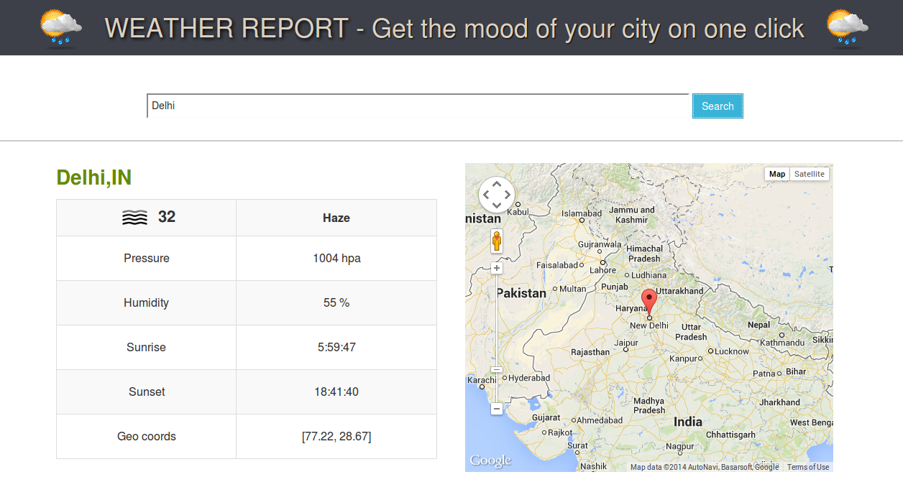

Knoldus Rust WebAssembly Weather_Report
======================

Weather Information System- Get the mood of your city on one click  This is simple project using Rust and WebAssembly.




*************************************************************************************************************
### Getting Started with Code  : 

## Run the application

Prerequisite : 

* Rust and npm
* We are using [OpenWeather API](https://openweathermap.org/). Please add your api key in [get_response()](https://github.com/knoldus/rust-webassembly-weather-report/blob/master/src/lib.rs#L229) method. 

```
async fn get_response(location: &str) -> JsonValue {
    let url1 = "http://api.openweathermap.org/data/2.5/weather?q=";
    let url2 = "&appid=<apikey>";

    let url = [url1, location, url2].concat();

    let resp = reqwest::get(&url).await.unwrap().text().await.unwrap();

    json::parse(&resp).unwrap()
}
```


```shell
$ npm install
$ npm start
```
    Go to browser and run http://localhost:8080
